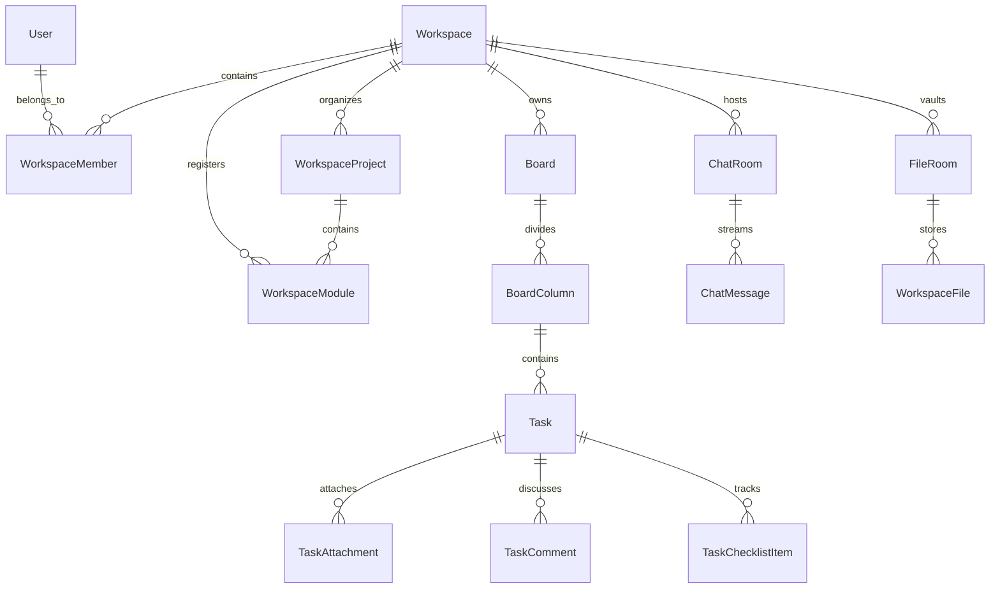

# Northstar Database Architecture & ERD Specification

## 1. Relational Topology



---

## 2. Key Indexes & Optimization Strategies

### 2.1 Workspace Member Role Resolution
```sql
CREATE UNIQUE INDEX idx_workspace_member_unique ON workspace_members (workspace_id, user_id);
CREATE INDEX idx_workspace_member_user_id ON workspace_members (user_id);
```
- **Cache Layer:** `workspace:{workspaceId}:member:{userId}` stored in Redis with 30-minute TTL.

### 2.2 Chat Message Cursor Pagination
```sql
CREATE INDEX idx_chatmsg_room_created ON chat_messages (room_id, created_at DESC);
```
- **Query Shape:** `WHERE room_id = $1 AND created_at < $cursor ORDER BY created_at DESC LIMIT 50`.

### 2.3 Task Kanban Movement
- `position` utilizes float / dense integer spacing with `POSITION_GAP = 1000` to allow arbitrary reordering without re-indexing adjacent siblings.
